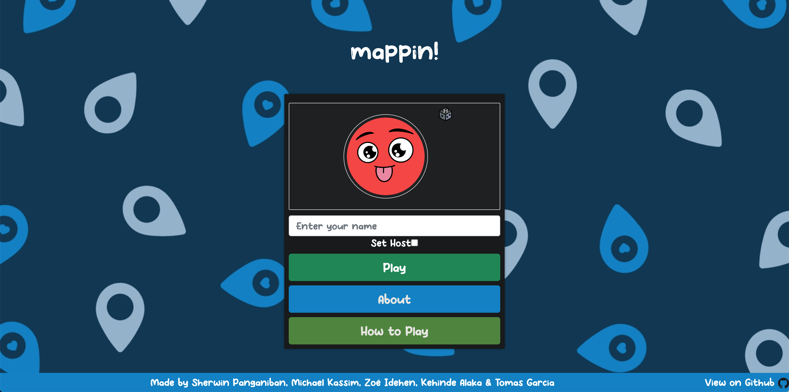
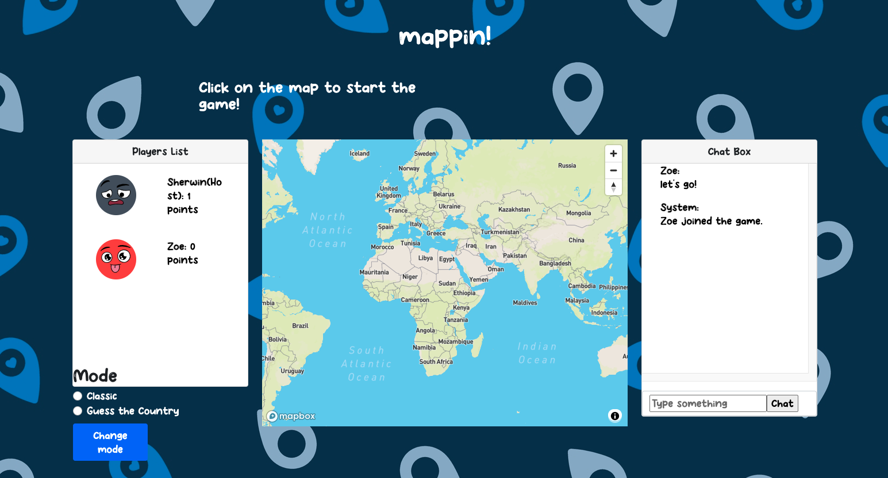

# MAPPIN

MAPPIN is a single or multiplayer interactive world map guessing game.

There are two modes to the game:

Classic (single player): player is given a country at random and they must find that country on the map before time runs out to earn points!

Guess the Country (multiplayer): Each round the host must describe their given country as clues and the other players must guess it in order to gain points! The person with the most points at the end of the game is declared the winner!

## Contributors

[](https://github.com/sherwingp) Sherwin Panganiban [](https://github.com/Fadaka) Michael Kassim [](https://github.com/zidehen) Zoë Idehen [](https://github.com/Alaka-K) Kehinde Alaka [](https://github.com/TomasGarciaDev) Tomas Garcia  

## Screenshots





## Full Stack Technologies

| Javascript | React| Node.js | Next.js | Mapbox | Socket.io |
| --- | --- | --- | --- | --- | --- | 
| <div align="center"></div> | --- | --- | --- | --- | --- | 

## How to Use

This app is fully deployed on Heroku [here](https://mappin-game.herokuapp.com/)

Alternatively, you can install the code and run the app locally:

1. From the command line, clone this repository to your machine:

```
git clone https://github.com/sherwingp/world-map-game.git
cd world-map-game
```

2. Install dependencies:
```
npm install #(requires node to be installed)
```

3. Then run the development server:
```
npm run dev
```

## User Stories

```
As a player,
So that I can play the game,
I would like to enter my player name
```

```
As a player,
So that I can understand the game better
I would like to read what the game is about
```

```
As a player,
So that I can know how to play the game,
I would like to read the rules of the game
```

```
As a player,
So that I can guess the secret location,
I would like to see a world map
```

```
As a host,
So that the other players can start the game
I want to be able to set the secret location
```

```
As a player, 
So that I can select my guesses,
I want to be able to click on the country that I guess on the map
```

```
As a player, 
So that I can know how well I’m doing,
I want to see my score
```

```
As a player, 
So that I know I guessed the right answer, 
I would like my score to go up
```

```
As a player,
So that I can compete against other players,
I want other players to join in my game
```

```
As a Player,
So that I know I'm close to the correct answer,
I would like the map to zoom in to a radius that includes the right answer
```